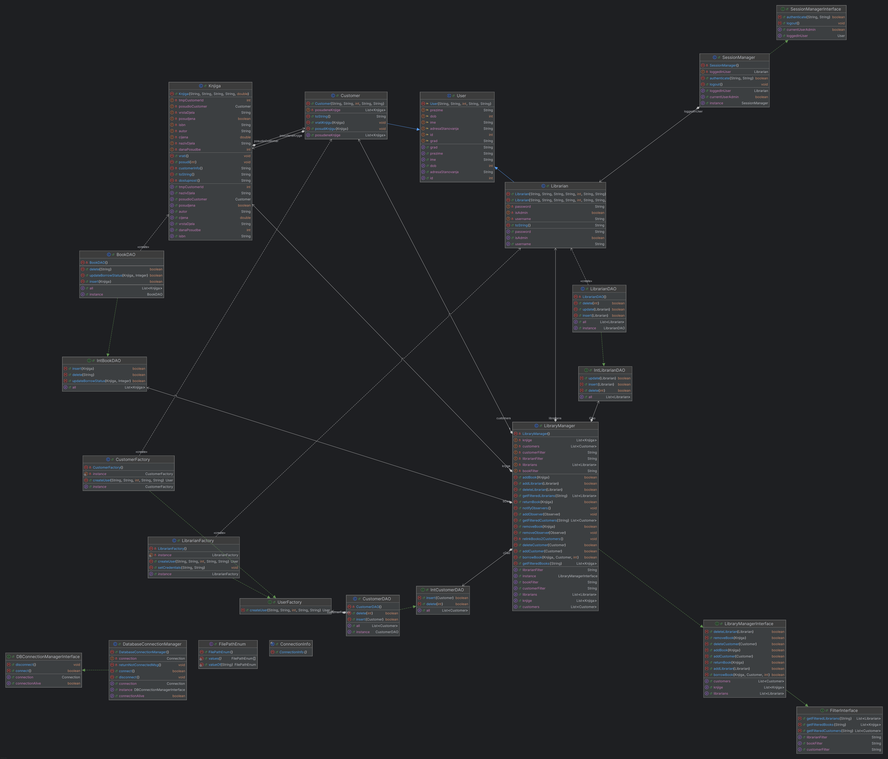
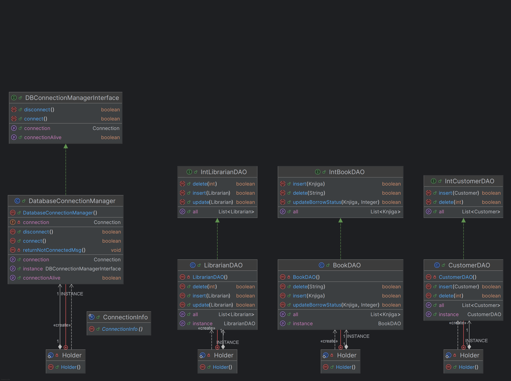
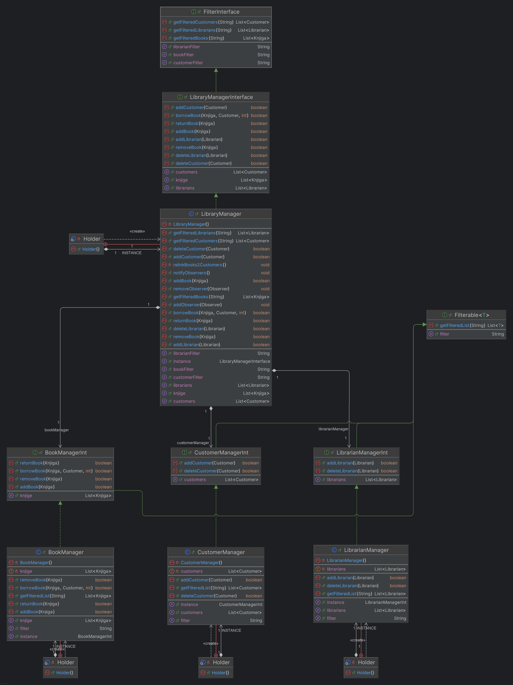
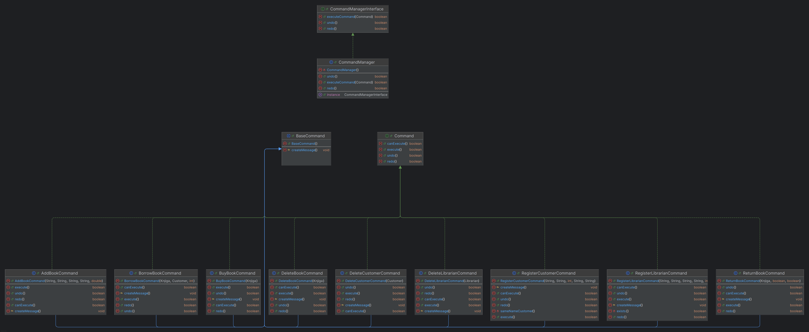
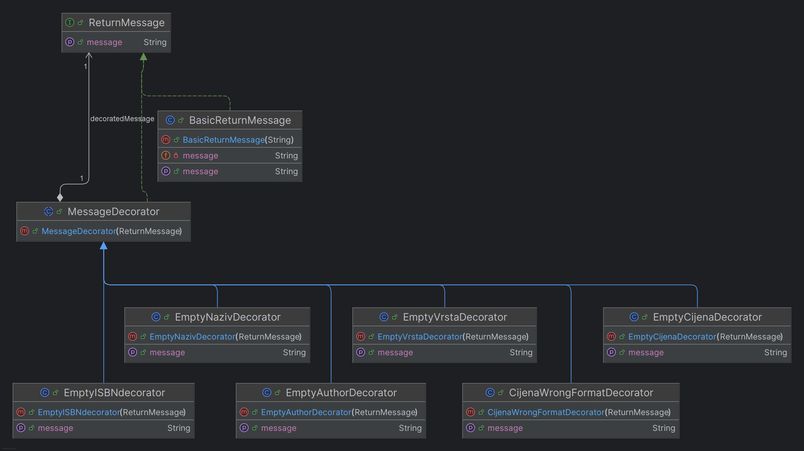
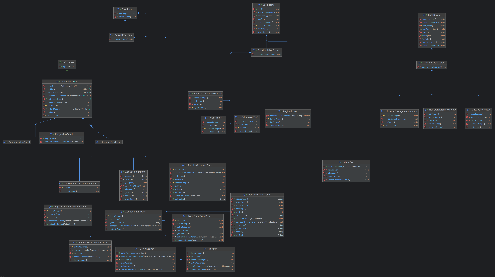

# 🖥️ Library Management System 9000

> *Desktop aplikacija za knjižničare u knjižnici izgrađena u Javi. Projekt je nadogradnja prethodnog projekta iz kolegija Osnove Objektnog Programiranja. Demonstrira primjenu objektno-orijentiranih principa (SOLID), MVC arhitekture i svih obrazaca dizajna (+ još nekih dodatnih) koje smo radili na predavanjima.*)

---

## 🏗️ Arhitektura (MVC)

Aplikacija je strukturirana prema **Model-View-Controller (MVC)** arhitektonskom obrascu kako bi se osiguralo jasno razdvajanje korisničkog sučelja od poslovne logike.

---
* **Model:** Sadrži podatke i poslovnu logiku. Obavještava View o promjenama (koristeći Observer obrazac).
* **View:** Implementiran pomoću **Java Swing** biblioteke. Prikazuje podatke iz Modela korisniku i prosljeđuje korisničke akcije Controlleru.
* **Controller:** Prima unos od korisnika (preko View-a), obrađuje ga i ažurira Model.

---


## 🧩 Detaljan opis UML dijagrama klasa


S obzirom na to da se projekt sastoji od preko 100 klasa, UML dijagram i arhitektura sustava logički su podijeljeni u nekoliko ključnih modula prema 
**MVC** (Model-View-Controller) arhitekturi i primijenjenim **SOLID** principima. 
Sustav obilato koristi objektno-orijentirane obrasce dizajna (Design Patterns) kako bi se osigurala skalabilnost,
slaba povezanost komponenti (*loose coupling*) i lako održavanje.

U nastavku je detaljan opis strukture klasa po paketima i njihovim odgovornostima:

### 1. Domenski entiteti i kreiranje objekata (Paket: `BackEnd` i `FactoryComps`)
Ovaj dio predstavlja srž **Modela** i definira podatke koji se obrađuju u sustavu.
* **Entiteti:** Osnovne klase su `Knjiga` i apstraktna klasa `User` koju nasljeđuju konkretne implementacije 
`Customer` (član knjižnice) i `Librarian` (Knjižničar). Ove klase enkapsuliraju atribute i ponašanje stvarnih objekata.
* **Factory obrazac (Tvornica):** Za instanciranje složenih korisničkih objekata koristi se Factory obrazac. 
Kroz sučelja i klase `UserFactory`, `CustomerFactory` i `LibrarianFactory` centralizirana je logika kreiranja objekata,
čime se skriva kompleksnost inicijalizacije od ostatka sustava.
* **Upravljanje sjednicom:** `SessionManager` (i `SessionManagerInterface`) implementira logiku praćenja trenutno prijavljenog korisnika (knjižničara) u sustav.

*(Ovdje slijedi UML dijagram domenskih entiteta)*
<details>
  <summary>🔎 Klikni ovdje za prikaz </summary>



</details>

### 2. Komunikacija s bazom podataka (Paket: `DataAccessObject`)
Podatkovni sloj koristi **DAO (Data Access Object)** obrazac kako bi u potpunosti odvojio logiku pristupa bazi od poslovne logike aplikacije.
* **Konekcija:** `DatabaseConnectionManager` implementira `DBConnectionManagerInterface`, te upravlja životnim ciklusom konekcije prema bazi
dobivajući podatke spajanje na bazu iz (`ConnectionInfo`).
* **DAO Sučelja i Klase:** Svaki domenski entitet ima pripadajuće sučelje (`IntBookDAO`, `IntCustomerDAO`, `IntLibrarianDAO`) i 
konkretnu implementaciju (`BookDAO`, `CustomerDAO`, `LibrarianDAO`).
* **Dijagram DAO sloja** prikazuje implementaciju Data Access Object i Singleton obrazaca dizajna.
  Ovaj sloj je zadužen isključivo za SQL komunikaciju i mapiranje podataka. Korištenjem statičkih 
'Holder' klasa (Singleton) osigurano je optimalno korištenje memorije i spriječeno višestruko spajanje na bazu. 
Programiranjem prema sučeljima (npr. IntBookDAO) postignuta je slaba povezanost (loose coupling) komponenti sustava."

*(Ovdje slijedi UML dijagram komunikacije s bazom)*
<details>
  <summary>🔎 Klikni ovdje za prikaz </summary>



</details>


### 3. Poslovna logika (Paket: `Management`)
Management klase djeluju kao posrednici između DAO sloja i Controllera (komandi). One drže poslovna pravila.
* Klase `LibraryManager`, `BookManager`, `CustomerManager` i `LibrarianManager` upravljaju kolekcijama podataka u memoriji i delegiraju zahtjeve prema DAO sloju. Svaki menadžer implementira svoje sučelje (npr. `BookManagerInt`).
* **Pretraživanje:** Pomoću sučelja `Filterable` i `FilterInterface` implementirana je napredna višekriterijska pretraga entiteta.

*(Ovdje slijedi UML dijagram za poslovnu logiku)*
<details>
  <summary>🔎 Klikni ovdje za prikaz </summary>



</details>


### 4. Controller sloj i upravljanje akcijama (Paket: `Commands`)
Aplikacija ne koristi klasični, masivni Controller, već primjenjuje **Command obrazac (Naredba)**, čime se svaka korisnička akcija pretvara u zaseban objekt.
* Osnova su sučelje `Command` i apstraktna klasa `BaseCommand`.
* **Konkretne naredbe:** Svaka funkcionalnost ima svoju klasu: `AddBookCommand`, `BorrowBookCommand`, `ReturnBookCommand`, `BuyBookCommand`, `DeleteCustomerCommand`, `RegisterLibrarianCommand`, itd. Enum `ActionCommandsEnum` definira dostupne akcije.
* Aplikacijom orkestrira `CommandManager` (preko `CommandManagerInterface`) koji prima zahtjeve iz grafičkog sučelja i izvršava ih, prosljeđujući ih Management sloju.

*(Ovdje slijedi UML dijagram za Commands)*
<details>
  <summary>🔎 Klikni ovdje za prikaz </summary>



</details>

### 5. Fleksibilna validacija (Paket: `Decorators`)
Za složenu validaciju korisničkih unosa i generiranje detaljnih poruka o pogreškama implementiran je **Decorator obrazac**.
* Baza je sučelje `ReturnMessage` i osnovna klasa `BasicReturnMessage`, te apstraktni `MessageDecorator`.
* **Specifični dekorateri:** Podijeljeni u pakete ovisno o kontekstu (`AddBookDecorators`, `BorrowBookDecorators`, `RegisterUserDecorators`...). Na primjer, prilikom dodavanja knjige mogu se dinamički ulančati `EmptyNazivDecorator` i `CijenaWrongFormatDecorator` kako bi se vratila složena, objedinjena poruka o pogrešci bez mijenjanja osnovnih klasa.

*(Ovdje slijedi UML dijagram za Dekoratore)*
<details>
  <summary>🔎 Klikni ovdje za prikaz </summary>



</details>

### 6. Reaktivno korisničko sučelje (Paket: `ObserversAndOtherComps`)
Kako bi grafičko sučelje (**View**) automatski reagiralo na promjene u bazi podataka, integriran je **Observer obrazac (Zapažač)**.
* Logika je definirana kroz sučelja `Observable` i `Observer`.
* Komponente sučelja, kao što su `ViewPanel`, `CustomerViewPanel`, `KnjigeViewPanel` i `LibrarianViewPanel`, djeluju kao pretplatnici. Kada `CommandManager` promijeni stanje sustava, `LibraryManager` emitira obavijest preko `Observable`, te osigurava da se sve tablice na ekranu automatski i trenutno osvježe s novim podacima.

*(Ovdje slijedi UML dijagram za Observere)*
<details>
  <summary>🔎 Klikni ovdje za prikaz </summary>


</details>

### 7. Dinamička naplata (Paket: `StrategyComps`)
Kupovina knjiga i naplata zakasnina izgrađena je na **Strategy obrascu (Strategija)**, čime je omogućeno lako dodavanje novih metoda plaćanja.
* Sučelje `PaymentStrategy` propisuje metodu obrade plaćanja.
* Implementacije `CardPayment`, `CashPayment` i `CryptoPayment` definiraju specifične algoritme za transakcije, na temelju odabira iz `PaymentStrategyEnum`.

*(Ovdje slijedi UML dijagram Strategy)*
<details>
  <summary>🔎 Klikni ovdje za prikaz </summary>


</details>

### 8. Grafički sloj - View (Paketi: `GUI_Comps`, `MainFrameComps`, itd.)
GUI sloj maksimalno primjenjuje principe nasljeđivanja i kompozicije komponenti biblioteke `Java Swing`.
* **Zajednička baza:** Kako bi se izbjeglo ponavljanje koda, kreirane su roditeljske klase `BaseFrame`, `BaseDialog` i `BasePanel` (uz varijacije poput `ActiveBasePanel`, `ShortcuttableFrame`, `ShortcuttableDialog`).
* **Modularnost:** Svaki prozor aplikacije izdvojen je u vlastiti paket (`AddBookComps`, `RegisterCustomerComps`, `LoginComps`...). Složeni prozori građeni su principom **kompozicije** (npr. `RegisterLibrarianWindow` sastoji se od `ConjoinedRegisterLibrarianPanel` i `RegisterLibLeftPanel`), uz pomoć dodatnih *utility* klasa za efekte vizualizacije (`EffectUtils`). Alatne trake i meniji modularno su izvedeni (`MenuBar`, `ToolBar`).

*(Ovdje slijedi UML dijagram GUI)*
<details>
  <summary>🔎 Klikni ovdje za prikaz </summary>



</details>

---
## 🗄️ Detaljan opis ER modela baze podataka (ERD)

Baza podataka sastoji se od tri ključna entiteta koja prate poslovanje knjižnice. Struktura je dizajnirana kako bi podržala perzistenciju objekata uz osiguranje integriteta podataka.


### 1. Entiteti i atributi (Struktura tablica)


Definirane su sljedeće tablice unutar sustava:

#### 📘 Tablica `Books` (Entitet: **Knjiga**)
| Atribut | Tip podatka               | Opis |
| :--- |:--------------------------| :--- |
| `isbn` | **VARCHAR (PRIMARY_KEY)** | Jedinstveni međunarodni identifikator knjige. |
| `naziv_djela` | VARCHAR                   | Naslov knjige. |
| `autor` | VARCHAR                   | Ime i prezime autora. |
| `vrsta_djela` | VARCHAR                   | Žanr ili kategorija knjige. |
| `cijena` | DOUBLE                    | Prodajna ili nabavna vrijednost. |
| `posudjena` | BOOLEAN                   | Zastavica (0/1) za trenutni status dostupnosti. |
| `dana_posudbe` | INT                       | Broj dana na koji je knjiga iznajmljena. |
| `customer_id` | **INT (FOREIGN_KEY)**     | Poveznica s kupcem koji drži knjigu (može biti `NULL`). |

#### 👥 Tablica `Customers` (Entitet: **Korisnik**)
| Atribut | Tip podatka                           | Opis |
| :--- |:--------------------------------------| :--- |
| `id` | **INT (PRIMARY_KEY, AUTO_INCREMENT)** | Interni automatski generirani broj korisnika. |
| `ime` | VARCHAR                               | Ime korisnika. |
| `prezime` | VARCHAR                               | Prezime korisnika. |
| `dob` | INT                                   | Starost korisnika. |
| `grad` | VARCHAR                               | Grad stanovanja. |
| `adresa_stanovanja`| VARCHAR                               | Adresa za dostavu i kontakt. |

#### 🔑 Tablica `Librarians` (Entitet: **Knjižničar**)
| Atribut | Tip podatka | Opis |
| :--- | :--- | :--- |
| `id` | **INT (PRIMARY_KEY, AUTO_INCREMENT)** | Jedinstveni ID zaposlenika. |
| `username` | **VARCHAR (UNIQ)** | Jedinstveno korisničko ime za prijavu. |
| `password` | VARCHAR | Lozinka za pristup sustavu (Plain-text/Encrypted). |
| `is_admin` | BOOLEAN | Razina ovlasti (0 - zaposlenik, 1 - administrator). |
| *Osobni podaci* | - | Sadrži i atribute: `ime`, `prezime`, `dob`, `grad`, `adresa`. |

---

### 2. Relacije među entitetima

Glavna relacija u sustavu uspostavljena je radi praćenja procesa posudbe:

> **Relacija: Jedan-na-više (1:N)**
> * **Logika:** Jedan korisnik (`Customer`) može posuditi više knjiga istovremeno.
> * **Ograničenje:** Jedna konkretna knjiga (`Book`) u danom trenutku može biti kod najviše jednog korisnika.
> * **Implementacija:** Relacija se ostvaruje preko stranog ključa **`customer_id`** u tablici `Books`.

**Napomena o integritetu:**
Kada se knjiga vrati u knjižnicu, logika unutar `BookDAO.updateBorrowStatus` metode postavlja `customer_id` na `NULL`, čime se knjiga oslobađa za buduće posudbe.

---

### 3. SQL Skripta za kreiranje baze (DDL)
<details>
  <summary>🔎 Klikni ovdje za prikaz SQL DDL skripte</summary>

```sql
CREATE DATABASE IF NOT EXISTS KnjiznicaDB;
USE KnjiznicaDB;

CREATE TABLE Customers (
                           id INT AUTO_INCREMENT PRIMARY KEY,
                           ime VARCHAR(50),
                           prezime VARCHAR(50),
                           dob INT,
                           grad VARCHAR(50),
                           adresa_stanovanja VARCHAR(100)
);

CREATE TABLE Librarians (
                            id INT AUTO_INCREMENT PRIMARY KEY,
                            ime VARCHAR(50),
                            prezime VARCHAR(50),
                            dob INT,
                            grad VARCHAR(50),
                            adresa_stanovanja VARCHAR(100),
                            username VARCHAR(50) UNIQUE NOT NULL,
                            password VARCHAR(255) NOT NULL,
                            is_admin BOOLEAN DEFAULT FALSE
);

CREATE TABLE Books (
                       isbn VARCHAR(20) PRIMARY KEY,
                       naziv_djela VARCHAR(100),
                       autor VARCHAR(100),
                       vrsta_djela VARCHAR(50),
                       cijena DOUBLE,
                       posudjena BOOLEAN DEFAULT FALSE,
                       dana_posudbe INT DEFAULT 0,
                       customer_id INT,
                       FOREIGN KEY (customer_id) REFERENCES Customers(id) ON DELETE SET NULL
);
``` 
</details>

## 🧩 Obrasci dizajna (Design Patterns)

Kako bi kod bio održiv, fleksibilan i proširiv, implementirani su sljedeći obrasci dizajna:

---

| Obrazac (Pattern)           | Paket/Klasa                                            | Opis i uloga u projektu                                                                                                                                                                                                           |
|:----------------------------|:-------------------------------------------------------|:----------------------------------------------------------------------------------------------------------------------------------------------------------------------------------------------------------------------------------|
| **Strategy**                | `StrategyComps` + klasa `BuyBookWindow`                | Omogućuje dinamičku promjenu načina plaćanja pri kupovini knjige (CashPayment, CardPayment...).                                                                                                                                   |
| **Observer**                | `ObserversAndOtherComps` i Observable `LibraryManager` | Korišten za komunikaciju između Modela (`LibraryManager`) i View-a (`ViewPanel`). Kada se podaci u Modelu promijene, View se automatski osvježava bez čvrste vezanosti (loose coupling).                                          |
| **Fasada**                  | `LibraryManager` klasa                                 | Iako je prethodno opisan kao `Observable`, ujedno je i "Fasada" za sve operacije. Zbrinjava se za kompleksne operacije delegirajući radnje svojim pod-menadžerima što omogućava jednostavne pozive za akcijom, te osvježava View. |
| **Command**                 | `Commands` paket                                       | Enkapsulira korisničke zahtjeve (npr. klikove na gumbe) u objekte. Ovo olakšava implementaciju funkcionalnosti poput *Undo/Redo*.                                                                                                 |
| **Decorator**               | `Decorators` paket                                     | Omogućuje dinamičko stvaranje poruka Obavijesti, Upozorenja ili Greški.                                                                                                                                                           |
| **Factory i SimpleFactory** | `FactoryComps` paket                                   | "Factory" za stvaranje objekata `User` podklasa: `Customer` i `Librarian`.                                                                                                                                                        |
| **Singleton**               | `Manager` i `DAO` klase                                | U projektu je korišten Bill Pugh Singleton obrazac za sve DAO i "Manager" klase. Singleton zato što nam ne treba nego jedna instanca ovih klasa (jer nam treba i samo jedan izvor podataka + štedi memoriju).                     |
| **Data Access Object**      | `DataAccessObject` paket                               | DAO obrazac korišten je za postizanje separation of concerns (razdvajanje odgovornosti). Poslovna logika komunicira s podacima isključivo preko DAO sučelja, čime je postignuta visoka modularnost i olakšano održavanje sustava. |
## 📂 Struktura projekta

Ukratko, mapa projekta izgleda ovako:

---

```text
src/
 ├── AddBookComps/                  # GUI komponente za "AddBookWindow" prozor
 ├── BackEnd/                       # Domenski entiteti i klase za manipulaciju podacima
 │    ├── DataAccessObject/         # DAO klase za direktnu komunikaciju s bazom (SQL)
 │    ├── FactoryComps/             # Implementacija Factory obrasca za kreiranje objekata
 │    └── Management/               # Poslovna logika i upravljanje listama entiteta
 ├── BuyBookComps/                  # GUI komponente za "BuyBookWindow" prozor
 ├── Commands/                      # Implementacija Command obrasca (akcije korisnika)
 ├── Decorators/                    # Dekoratori za dinamičku validaciju i ispis grešaka
 │    ├── AddBookDecorators/        # Validacije pri dodavanju knjiga
 │    ├── BorrowBookDecorators/     # Validacije pri posuđivanju knjiga
 │    ├── DeleteBookDecorators/     # Validacije pri brisanju knjiga
 │    ├── DeleteUserDecorators/     # Validacije pri brisanju korisnika/knjižničara
 │    ├── RegisterUserDecorators/   # Validacije pri registraciji (ime, prezime, lozinka...)
 │    └── ReturnBookDecorators/     # Validacije i naplate pri povratu knjiga
 ├── GUI_Comps/                     # Bazične klase (BaseFrame, BasePanel) koje nasljeđuju ostale GUI klase
 ├── LibrarianManagementComps/      # GUI komponente za upravljanje knjižničarima
 ├── LoginComps/                    # GUI komponente za prozor za prijavu
 ├── MainFrameComps/                # GUI komponente za glavni prozor aplikacije (MainFrame)
 ├── ObserversAndOtherComps/        # Observer implementacije (ViewPanel) i polja za pretragu
 ├── RegisterCustomerComps/         # GUI komponente za registraciju novih članova
 ├── RegisterLibrarianComps/        # GUI komponente za dodavanje novih zaposlenika
 ├── ReturnBookComps/               # GUI komponente za proces vraćanja knjiga
 ├── StrategyComps/                 # Klase i sučelja za implementaciju Strategy dizajna (naplate)
 ├── UniverzalnoSucelje/            # Pomoćna univerzalna sučelja (ActionCommandListener)
 ├── App.java                       # Glavna ("Main") klasa za pokretanje aplikacije
 └── SQLQueries                     # Datoteka sa SQL skriptama za kreiranje baze
 ```

## ⚙️ Opis rada projekta


### 🔄 Primjer toka izvršavanja: Brisanje knjige (Command & DAO Pattern)

Kako bismo osigurali čistu arhitekturu i razdvojili korisničko sučelje od poslovne logike, korisničke akcije su enkapsulirane u Command objekte.

Evo detaljnog pregleda (korak-po-korak) što se događa "ispod haube" kada korisnik klikne gumb **"Izbriši"** u AddBookWindow prozoru:

<details>
  <summary>🔎 Klikni ovdje za prikaz primjera koda </summary>

1. **Korisnička akcija (View):** Korisnik pritisne `JButton` za brisanje. Listener registrira događaj i prosljeđuje ga CommandManager-u.
```java
@Override
protected void activateComps(){
    addBookRightPanel.setAddBookWindowListener(new ActionCommandListener() {
        @Override
        public void eventOccurred(String actionCommand) {
            // Akcija za dodavanje nove knjige
            if (actionCommand == ActionCommandsEnum.ADD) {
                izvrsiUnos();

            }
            // Akcija za brisanje trenutno odabrane knjige iz liste
            if (actionCommand == ActionCommandsEnum.DELETE) {
                Knjiga k = addBookRightPanel.getSelectedBook(); //<------------------------Dohvaćamo objekt knjige iz ViewPanel-a
                CommandManager.getInstance().executeCommand(new DeleteBookCommand(k)); //<-Kreirana komanda i  poslana CommandManageru🟢!
            }
            // Zatvaranje ovog prozora i povratak na MainFrame
            if (actionCommand == ActionCommandsEnum.BACK) {
                new MainFrame();
                dispose();
            }
        }
    });
}
```
*Primjer koda iz AddBookWindow klase u AddBookComps paketu | linija 95:*


2. **Kreiranje komande:** Listener prepoznaje akciju i instancira novu komandu `DeleteBookCommand`, prosljeđujući joj odabranu instancu klase `Knjiga` kao parametar.

```java
@Override
public boolean executeCommand(Command cmd) {
    if(DatabaseConnectionManager.getInstance().isConnectionAlive()){
        if (cmd.canExecute()) {
            if (cmd.execute()) {
                undoStack.push(cmd);
                // Ključno: Svaka nova akcija briše redo povijest jer se stvara nova grana događaja
                redoStack.clear();
                System.out.println("Komanda izvršena i dodana u Undo stog.");
                return true;
                }
            }
        return false;
    }
    JOptionPane.showMessageDialog(null, "Niste povezani na bazu podataka!", "Greška", JOptionPane.ERROR_MESSAGE);
    return false;
}
```
*Metoda executeCommand(Command cmd) koja je pozvana u prošlom kodu*

3. **Upravljanje komandama (CommandManager):** Kreirana komanda se predaje `CommandManager`-u
(implementiranom kao *Singleton*). On preuzima komandu i poziva njezinu metodu `canExecute()` koja provjerava jesu li 
ispunjeni uvjeti za izvršavanje operacije, zatim je izvršava pomoću `execute()`.

```java
@Override
protected void createMessage() {

    ReturnMessage msg = new BasicReturnMessage("Greška pri brisanju:");

    if (bookToDelete == null) {
        msg = new BookNotSelectedDecorator(msg);
    } else if (bookToDelete.isPosudjena()) {
        msg = new BookAlreadyBorrowedDecorator(msg);
    }

    JOptionPane.showMessageDialog(null, msg.getMessage(), "Neuspjela validacija", JOptionPane.ERROR_MESSAGE);
}

@Override
public boolean canExecute() {
    if (bookToDelete == null || bookToDelete.isPosudjena()) {
        createMessage();
        return false;
    }
    return true;
}

@Override
public boolean execute() {
    if(libraryManager.removeBook(bookToDelete)){
        JOptionPane.showMessageDialog(null, "Knjiga uspješno izbrisana!", "Uspjeh", JOptionPane.INFORMATION_MESSAGE);
        return true;
    }
    return false;
}

```
*Metoda createMessage() je metoda dobivena nasljeđivanjem BaseCommand klase. Budući da su Command klase zadužene
za dosta provjera, u ovoj metodi se grade poruke o greškama pomoću dekoratora 
("lijepljenje" poruka svih grešaka u jednu poruku.)*

4. **Poslovna logika (Model):** Ako su uvjeti zadovoljeni, komanda poziva `LibraryManager.removeBook(Knjiga k)` 
koja prosljeđuje (delegira) poziv metode na `bookManager.removeBook(Knjiga k)`. *(Da je u pitanju bilo brisanje Customera 
pozvao bi se CustomerManager ili LibrarianManager za Librarian objekt)*

```java
@Override
public boolean removeBook(Knjiga k) {
  // 1. Ako je operacija uspješna:
  if (bookManager.removeBook(k)) {
    // 2. Obavještavamo sve Observere da se osvježe.
    notifyObservers();
    return true;
  }
  return false;
}
```


5. **BookManager (BookManagerInt):** `BookManager` pokreće SVOJU `removeBook()` metodu pri kojoj gleda je li `BookDAO` uspješno izbrisao knjigu.
```java
@Override
public boolean removeBook(Knjiga k) {
  // 1. Provjeravamo je li brisanje knjige iz baze uspješno
  if (bDao.delete(k.getIsbn())) {

    // 2. Ako je, brišemo je iz radne memorije.
    knjige.remove(k);

    return true;
  }
  return false;
}
```

6. **Baza podataka (DAO):** `BookManager` delegira konačni zadatak klasi `BookDAO`,
   koja izvršava stvarni SQL upit i trajno uklanja knjigu iz MySQL baze podataka (vraća `true` ako je konekcija s bazom "živa"
   i ako je operacija uspješna.). Ako je `BookDAO.delete()` vratio `true` tek onda `BookManager` briše knjigu iz radne memorije.

```java
@Override
public boolean delete(String isbn) {
  String sql = "DELETE FROM Books WHERE isbn = ?";
  Connection conn = DatabaseConnectionManager.getInstance().getConnection();

  if(conn != null) {
    try (PreparedStatement pstmt = conn.prepareStatement(sql)) {
      pstmt.setString(1, isbn);
      pstmt.executeUpdate();
      return true;
    } catch (SQLException e) {
      e.printStackTrace();
      JOptionPane.showMessageDialog(null, e.getMessage(), this.getClass().getSimpleName() + " - SQL Error", JOptionPane.ERROR_MESSAGE);
      return false;
    }
  }
  return false;
}
```


*Razlog za tolikim korištenjem `boolean` povratnog tipa metode je radi CommandManagera:
Ako je sve `true`sprema Command objekt u undo stog (Pogledajte kod gore)*

</details>


---

### 🛡️ Integritet podataka i slojevitost
Projekt strogo poštuje pravilo razdvajanja odgovornosti **(Separation of Concerns (SoC))**:
* **Command klase** ne znaju za SQL. One služe isključivo za kontrolu toka i validaciju poslovnih pravila.
* **LibraryManager** je "mozak" aplikacije koji drži sinkronizirano stanje u memoriji s onim u bazi.
* **DAO (Data Access Object)** je jedina točka kontakta s bazom podataka, čime je postignuta visoka modularnost sustava.

---

## 📦 Popis vanjskih biblioteka i modula

U razvoju aplikacije korišten je **Apache Maven** za upravljanje ovisnostima. 
Korištene biblioteke omogućuju rad s bazom podataka te moderno i responzivno grafičko sučelje.

---

### 1. MySQL Connector/J
* **Namjena:** Službeni JDBC upravljački program (driver) koji omogućuje komunikaciju između Jave i MySQL baze podataka. Neophodan je za izvršavanje SQL upita unutar DAO klasa.
* **Osnovni podaci:**
    * **Grupa i artefakt:** `com.mysql:mysql-connector-j`
    * **Verzija:** `9.6.0`
    * **Lokacija preuzimanja:** [Maven Repository](https://mvnrepository.com/artifact/com.mysql/mysql-connector-j)
    * **Službena dokumentacija:** [MySQL Connector/J Manual](https://dev.mysql.com/doc/connector-j/en/)

---

### 2. Radiance Framework
Radiance je skup biblioteka koji zamjenjuje standardni Swing "Look and Feel" modernim vizualnim stilovima i animacijama.

| Komponenta             | Namjena                                                                                                                                                                                                                           | Dokumentacija i lokacija                                                       |
|:-----------------------|:----------------------------------------------------------------------------------------------------------------------------------------------------------------------------------------------------------------------------------|:-------------------------------------------------------------------------------|
| **Radiance-theming**   | Glavni okvir za vizualni identitet aplikacije. Omogućava korištenje modernih "skinova" koji zamjenjuju zastarjeli izgled standardnog Swinga.                                                                                      | [GitHub Radiance](https://github.com/kirill-grouchnikov/radiance)              |
| **radiance-animation** | Biblioteka (ranije poznata kao Trident) koja upravlja svim vizualnim tranzicijama u aplikaciji. Koristi se za fadeIn i fadeOut efekte pri paljenju u gašenju prozora koji su implementirani u BaseFrame i BaseDialog.             | [GitHub Radiance](https://github.com/kirill-grouchnikov/radiance)              |
| **ephemeral-chroma**   | Dio Radiance ekosustava koji se bavi naprednim radom s bojama. Omogućava dinamičku promjenu paleta i usklađivanje boja komponenti unutar odabrane teme kako bi GUI bio koherentan. (Dodatak bez kojeg Radiance ne funkcionira...) | [GitHub Radiance](https://github.com/kirill-grouchnikov/radiance)              |
| **MySQL-connector-j**  | Službeni JDBC (Java Database Connectivity) upravljački program koji omogućava aplikaciji komunikaciju s MySQL poslužiteljem. Neophodan je za izvršavanje SQL upita i rad s podacima u bazi.                                                                                                                                                                             | [MySQL Connector/J Developer Guide](https://dev.mysql.com/doc/connector-j/en/) |


---

### 🛠️ Tehničke postavke projekta

Projekt je konfiguriran za rad na modernoj Java platformi, što je vidljivo iz postavki u `pom.xml` datoteci:

* **Java SDK:** Verzija 23 (koristi se za kompajliranje i izvođenje).
* **Encoding:** `UTF-8` (osigurava ispravan prikaz hrvatskih dijakritičkih znakova).
* **Maven:** U projektu se nalaze 4 vanjske biblioteke 

```xml
  <dependencies>

  <!-- Source: https://repo1.maven.org/maven2/org/pushing-pixels/radiance-animation/8.5.0/radiance-animation-8.5.0.jar --> <!-- [Direkt Download] -->
  
  <!-- Source: https://mvnrepository.com/artifact/org.pushing-pixels/radiance-animation -->
  <dependency>
    <groupId>org.pushing-pixels</groupId>
    <artifactId>radiance-animation</artifactId>
    <version>8.5.0</version>
  </dependency>

  <!-- Source: https://repo1.maven.org/maven2/org/pushing-pixels/radiance-theming/8.0.0/radiance-theming-8.0.0.jar -->      <!-- [Direkt Download] -->
  
  <!-- Source: https://mvnrepository.com/artifact/org.pushing-pixels/radiance-theming -->
  <dependency>
    <groupId>org.pushing-pixels</groupId>
    <artifactId>radiance-theming</artifactId>
    <version>8.0.0</version>
  </dependency>

  <!-- Source: https://repo1.maven.org/maven2/org/pushing-pixels/ephemeral-chroma/1.0.0/ephemeral-chroma-1.0.0.jar -->      <!-- [Direkt Download] -->

  <!-- Source: https://mvnrepository.com/artifact/org.pushing-pixels/ephemeral-chroma -->
  <dependency>
    <groupId>org.pushing-pixels</groupId>
    <artifactId>ephemeral-chroma</artifactId>
    <version>1.0.0</version>
    <scope>compile</scope>
  </dependency>

  <!-- Source: https://repo1.maven.org/maven2/com/mysql/mysql-connector-j/9.6.0/mysql-connector-j-9.6.0.jar -->             <!-- [Direkt Download] -->

  <!-- Source: https://mvnrepository.com/artifact/com.mysql/mysql-connector-j -->
  <dependency>
    <groupId>com.mysql</groupId>
    <artifactId>mysql-connector-j</artifactId>
    <version>9.6.0</version>
    <scope>compile</scope>
  </dependency>
</dependencies>
```
*Kreator: Juraj Šimičević, 2026. Zadar, UNIZD - Studij Informacijskih Tehnologija.*
